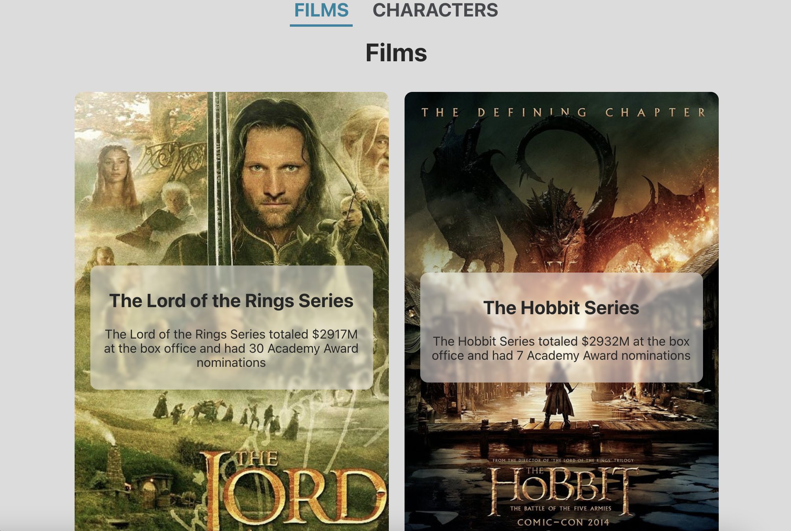

# The One API Challenge

Use [this repo](https://github.com/alchemycodelab/react-lotr-munging) as your template.

### Learning Objectives

- On load, use fetch to hit a GET endpoint, get all items, and set state and update the view using the response.
- Locate data, paging, and metadata in a REST response
- Use useEffect hook with a dependency array to retrieve data when a component first mounts
- Use .map to change the shape of an array of data
- Create the illusion of multiple pages in a Single Page Application routes by using react-router.

### Description

For this deliverable, you will be fetching data from the Lord of the Rings API and then using array methods to transform the data into different formats. Often when we receive data from a backend, its not exactly the format we need. This deliverable will allow you to practice data transformations.

More details on the exact shape required can be found in `App.js`

Additionally you will be creating two routes using React Router

- `/films` which should display the `<FilmList />` component and pass the `films` state variable as a prop
- `/characters` which should display the `<CharacterList />` component and pass the `characters` state variable as a prop

Final pages should look like this



### Acceptance Criteria

- Films route shows the list of films
- Characters route shows the list of characters

### Rubric

| Task             | Points |
| ---------------- | ------ |
| Films route      | 5      |
| Characters route | 5      |

# Steps

1. `npm i`
1. Create a `.env.development.local` file in the root directory
   1. REACT_APP_API_KEY={access token from the-one-api.dev}
   1. REACT_APP_SUPABASE_KEY={supabase key}
1. In `App.js`...
   1. In `getFilms` async function: 1. Start by pasting the following line:
      ```js
      const resp = await fetch(`${process.env.REACT_APP_SUPABASE_URL}/rest/v1/films)`, {
        headers: {
          apikey: process.env.REACT_APP_SUPABASE_KEY,
          Authorization: `Bearer ${process.env.REACT_APP_SUPABASE_KEY}`,
        },
      });
      ```
      - URL for characters: `${process.env.REACT_APP_SUPABASE_URL}/rest/v1/characters`
1. Q: How do we replace the spaces in film titles with '-'?
